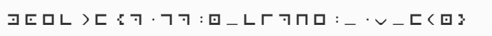
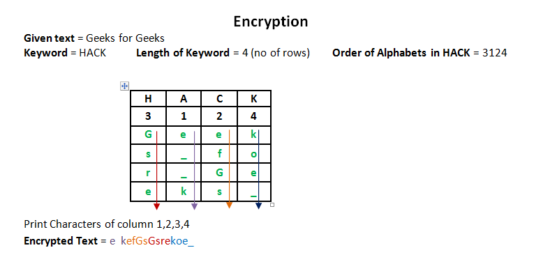
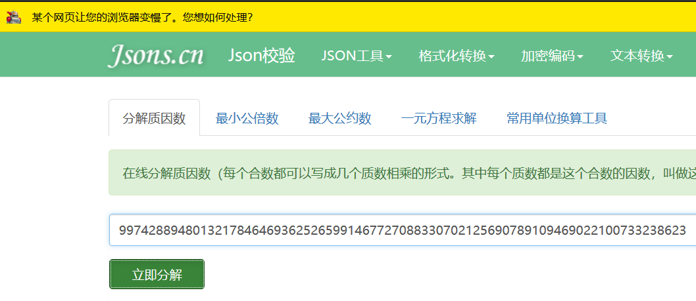
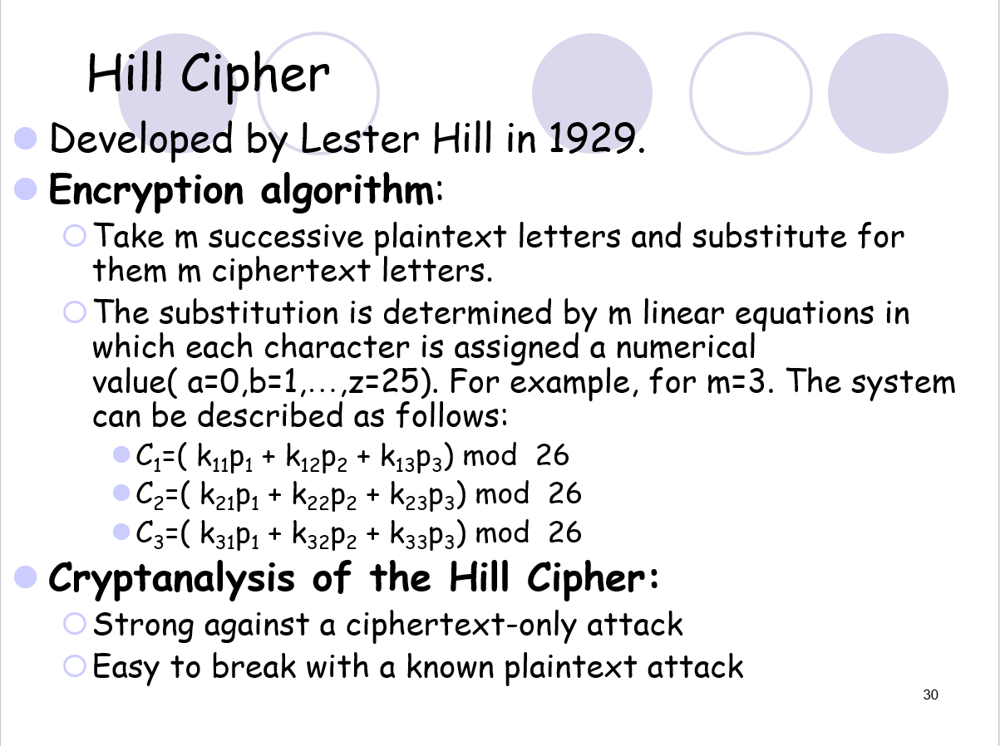
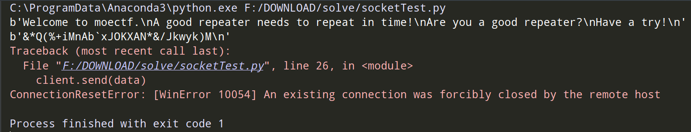

# Writeup For moeCTF

> author: xiaohuihui

## Sign In

### 你是西电新生嘛？

> XDSEC 2019招新信息放送群 `614458628`
> 加群时请务必注明姓名学号
> 其它学校选手请绕行！谢谢合作

此题是签到题，加入 招新群，在公告中即可找到<code>flag</code>信息

```html
moectf{0f_c0u3se_1_@m!}
```

## Reverse

> 本人无逆向基础，还请各位 师傅指导

### IntroducingRE

> 这题真的是入门题哦~
>
> Hint:
> + 可执行文件不一定只能拿来执行呀
> + IDA了解一下？

首先是打开程序看看：

```shell
Welcome to the MoeCTF!
Input your flag:
1
Oops, you are wrong...
Try to use IDA
Press any key to continue . . .
```

IDA搞起！发现main函数如下：

```c
int __cdecl main(int argc, const char **argv, const char **envp)
{
  int v4; // [esp+17h] [ebp-19h]
  int v5; // [esp+1Bh] [ebp-15h]
  int v6; // [esp+1Fh] [ebp-11h]
  int v7; // [esp+23h] [ebp-Dh]
  int v8; // [esp+27h] [ebp-9h]
  int v9; // [esp+2Bh] [ebp-5h]
  char v10; // [esp+2Fh] [ebp-1h]

  sub_401F10();
  puts("Welcome to the MoeCTF!");
  v4 = 1667592045;
  v5 = 1148937844;
  v6 = 1868128048;
  v7 = 845897589;
  v8 = 1230993263;
  v9 = 2101297476;
  v10 = 0;
  sub_401500((char *)&v4);
  return system("pause");
}
```

再查看 <code>sub_401500</code> 函数内容：

```c
int __cdecl sub_401500(char *a1)
{
  int result; // eax
  char v2; // [esp+1Ch] [ebp-6Ch]

  puts("Input your flag:");
  gets(&v2);
  if ( !strcmp(&v2, a1) )
    result = puts("You are right!");
  else
    result = puts("Oops, you are wrong...\nTry to use IDA");
  return result;
}
```

综合来看，程序的逻辑是：输入 flag 字符串与主函数中 <code>v4</code>进行比较，看看是否一致，一致则输出 You are right.猜测主函数中的<code>v4</code>所在的内存单元就是 flag。

既然是，内存中存放的是01，在IDA显示的是十六进制？？转化为 char 试试

 

```c
  v4 = 'ceom';
  v5 = 'D{ft';
  v6 = 'oY_0';
  v7 = '2k_u';
  v8 = 'I_wo';
  v9 = '}?AD';
  v10 = 0;
```

好像看出来什么，看起来是反的，联想到 Windows 字节序的小端法（多看点书还是有点用的。。。）

> 摘自 《深入理解计算机系统 原书第3版》P29
>
> 最低有效字节在最前面的方式，称为*小端法*
> ....
> 大多数 Intel 兼容机都只用小端模式

写出flag如下（0为字符串结束标志）：

```
moectf{D0_You_k2ow_IDA?}
```

### .pyc

> python不是解释型语言么？
> 当然

百度了一波

> python的编译后文件pyc，可以将pyc文件反编译为py文件

emmm，以前好像在哪看到过 ↓，python程序一旦发布就意味着源代码发布了？？？扯淡……

> 廖雪峰Python3 教程
>
> https://www.liaoxuefeng.com/wiki/1016959663602400/1016959735620448
>
> 第二个缺点就是代码不能加密。如果要发布你的Python程序，实际上就是发布源代码，这一点跟C语言不同，C语言不用发布源代码，只需要把编译后的机器码（也就是你在Windows上常见的xxx.exe文件）发布出去。要从机器码反推出C代码是不可能的，所以，凡是编译型的语言，都没有这个问题，而解释型的语言，则必须把源码发布出去。
>
> 这个缺点仅限于你要编写的软件需要卖给别人挣钱的时候。好消息是目前的互联网时代，靠卖软件授权的商业模式越来越少了，靠网站和移动应用卖服务的模式越来越多了，后一种模式不需要把源码给别人。
>
> 再说了，现在如火如荼的开源运动和互联网自由开放的精神是一致的，互联网上有无数非常优秀的像Linux一样的开源代码，我们千万不要高估自己写的代码真的有非常大的“商业价值”。那些大公司的代码不愿意开放的更重要的原因是代码写得太烂了，一旦开源，就没人敢用他们的产品了。

然后 百度了一波如何反编译 .pyc 

> https://www.jianshu.com/p/3a0398f7e23e

```shell
> pip install uncompyle6 -i https://pypi.mirrors.ustc.edu.cn/simple/ 
> uncompyle6 test.cpython-37.pyc > foo.py
```

```python
# uncompyle6 version 3.4.0
# Python bytecode 3.7 (3394)
# Decompiled from: Python 3.7.3 (default, Apr 24 2019, 15:29:51) [MSC v.1915 64 bit (AMD64)]
# Embedded file name: test.py
# Size of source mod 2**32: 294 bytes
from binascii import b2a_hex
from base64 import b32encode
x = input
y = print
if b2a_hex(b32encode(x().encode())).decode() == '4e5658574b5933554d5a3558413452544d4d59473234444a4e525557345a5a4e4b4234574758334447525846364d44514f51595732324c324d55575647344254474e5348323d3d3d':
    y('congrats')
# okay decompiling test.cpython-37.pyc
```

写个对应的 反过来的脚本 即可：

```python
from binascii import a2b_hex
from base64 import b32decode
code = '4e5658574b5933554d5a3558413452544d4d59473234444a4e525557345a5a4e4b4234574758334447525846364d44514f51595732324c324d55575647344254474e5348323d3d3d'
print(b32decode(a2b_hex(code)))
# b'moectf{pr3c0mpiling-Pyc_c4n_0pt1mize-Sp33d}'
```

### EasyJava

> 给大佬递咖啡！
> 附件 EasyJava.jar

用<code>jd-gui</code>工具打开，得到如下源码 ppp/Box.class

```java
package qqq;

import java.awt.GridLayout;
import java.awt.event.ActionEvent;
import java.awt.event.ActionListener;
import javax.swing.JButton;
import javax.swing.JFrame;
import javax.swing.JLabel;
import javax.swing.JPanel;
import javax.swing.JTextField;

public class Box
  implements ActionListener
{
  int size = 9;
  JButton[] jbs = new JButton[this.size];
  JPanel jp;
  JPanel jp1;
  JFrame jf;
  JLabel la;
  JTextField txt;
  JTextField tx;
  JLabel jt;
  JButton bt;
  JButton bt1;
  String a = "";
  
  public static boolean CHECK(int input)
  {
    if ((input > 10000000) && (input < 99999999))
    {
      int v7 = 1;
      int v8 = 10000000;
      int v3 = 1;
      if ((Math.abs(input / 1000 % 100 - 80) == 3) && (input % 1000 % 927 == 0))
      {
        int v5 = 0;
        while (v5 < 4)
        {
          if (input / v7 % 10 != input / v8 % 10)
          {
            v3 = 0;
            break;
          }
          v7 *= 10;
          v8 /= 10;
          v5++;
        }
        if (v3 != 1) {
          return false;
        }
        if (v3 == 1) {
          return true;
        }
      }
    }
    return false;
  }
  
  public Box()
  {
    this.jp = new JPanel();
    this.jp1 = new JPanel();
    this.jf = new JFrame();
    this.jf.setDefaultCloseOperation(3);
    this.tx = new JTextField(16);
    this.jt = new JLabel("Input passwd to change your flag!!!!!!!!!");
    this.bt = new JButton("check");
    this.bt1 = new JButton("clear");
    this.bt1.addActionListener(this);
    this.bt.addActionListener(this);
    this.la = new JLabel("Passwd:");
    
    this.txt = new JTextField(16);
    this.txt.setEnabled(false);
    this.jp1.add(this.la);
    this.jp1.add(this.txt);
    this.jp1.add(this.bt);
    this.jp1.add(this.bt1);
    this.jp1.add(this.jt);
    this.jp1.add(this.tx);
    this.jp.setLayout(new GridLayout(3, 3));
    for (int i = 0; i < this.size; i++)
    {
      this.jbs[i] = new JButton(String.valueOf(i + 1));
      this.jbs[i].addActionListener(this);
    }
    this.jf.setLayout(new GridLayout(2, 1));
    this.jf.add(this.jp1);
    this.jf.add(this.jp);
    for (int i = 0; i < this.size; i++) {
      this.jp.add(this.jbs[i]);
    }
    this.jf.setTitle("Box");
    this.jf.setSize(300, 400);
    this.jf.setDefaultCloseOperation(3);
    this.jf.setLocation(200, 200);
    
    this.jf.setVisible(true);
  }
  
  public static void main(String[] args)
  {
    new Box();
  }
  
  public void actionPerformed(ActionEvent e)
  {
    if (e.getSource() == this.jbs[0])
    {
      this.a += '1';
      this.txt.setText(this.a);
    }
    if (e.getSource() == this.jbs[1])
    {
      this.a += '2';
      this.txt.setText(this.a);
    }
    if (e.getSource() == this.jbs[2])
    {
      this.a += '3';
      this.txt.setText(this.a);
    }
    if (e.getSource() == this.jbs[3])
    {
      this.a += '4';
      this.txt.setText(this.a);
    }
    if (e.getSource() == this.jbs[4])
    {
      this.a += '5';
      this.txt.setText(this.a);
    }
    if (e.getSource() == this.jbs[5])
    {
      this.a += '6';
      this.txt.setText(this.a);
    }
    if (e.getSource() == this.jbs[6])
    {
      this.a += '7';
      this.txt.setText(this.a);
    }
    if (e.getSource() == this.jbs[7])
    {
      this.a += '8';
      this.txt.setText(this.a);
    }
    if (e.getSource() == this.jbs[8])
    {
      this.a += '9';
      this.txt.setText(this.a);
    }
    if (e.getSource() == this.bt) {
      if (CHECK(Integer.parseInt(this.a))) {
        this.tx.setText("moectf{" + (char)(Integer.parseInt(this.a) / 1000000) + (char)(Integer.parseInt(this.a) / 10000 % 100) + (char)(Integer.parseInt(this.a) / 100 % 100) + "_he}");
      } else {
        this.tx.setText("clear and try again!");
      }
    }
    if (e.getSource() == this.bt1)
    {
      this.txt.setText("");
      this.tx.setText("");
      this.a = "";
    }
  }
}

```

分析代码可知：只要找到合法的 a 即可

#### CHECK函数处理

如果手动解a的话，确实需要技巧，check函数的代码逻辑我也懒得看了，直接照抄一份去爆破。

通过下面的python脚本得出合适的<code>input</code>参数，思路在注释中体现

```python
#!/usr/bin/python
# 结合 java 代码写的 check函数
def check(i):
	v7 = 1
	v8 = 10000000
	v3 = 1
	v5 = 0
	while v5 < 4:
		if i // v7 % 10 != i // v8 % 10: # 注意整除是//，而 / 是精确除法
			v3 = 0
			break
		v7 *= 10
		v8 //= 10
		v5 += 1
	if v3 == 1:
		return True

# 由条件判断条件可知，10000000 < i < 99999999
'''
由(input % 1000 % 927 == 0) 推出 input % 1000 = 927*n, n为自然数
由于927*n < 1000 得 n=1, 即 input % 1000 = 927
input = 927 + 1000*n, n为自然数
'''
# 由于懒，直接从927开始遍历，每次加1000，直到99999999结束，输出所有可能的值
for i in range(927,99999999,1000):
	if i < 10000000:
		continue
	else:
        # Math.abs(input / 1000 % 100 - 80) == 3)
		if abs(i // 1000 % 100 - 80) == 3:
			if check(i):
				print(i)
# 72977927
```

#### 得到Flag

既然得到了值，二话不说，直接上 Java 代码！

```java
public static void main(String[] args)
{
    // new Box();
    String a = "72977927";

    System.out.print("moectf{" + (char)(Integer.parseInt(a) / 1000000) + (char)(Integer.parseInt(a) / 10000 % 100) + (char)(Integer.parseInt(a) / 100 % 100) + "_he}");
}
```

```
moectf{HaO_he}
```

咖啡真好喝！

## Crypto

> 本人仅仅懂一点简单的密码学，还请各位大佬 带飞 :)

### Pigpen Cipher



猪圈密码，百度一下，你就知道，附上在线解码网站：

http://www.nicetool.net/app/pigpen_chiper_decrypt.html

```
moectf{p1gp2n_ciphe2_1s_fun}
```

### Rail fence cipher

```shell
# cipher
mthAf2p_anf@ccta}ofEi3_hl_d_sar0pe{_Lncesk_cslyghctr_c12_i0li_pry
```

在线解密：https://www.qqxiuzi.cn/bianma/zhalanmima.php

```
moectf{thE_rAiL_f3nc2_c1phe2_ls_a_kind_0f_cl@ssical_crypt0graphy}
```

### Bacon's Cipher

> 第十二篇:培根密码
>
> https://www.33iq.com/group/topic/242201/
>
> 培根所用的密码是一种本质上用二进制数设计的。不过，他没有用通常的0和1来表示，而是采用a和b。下面是他设计的26个英文字母二进制表示法。
>
> 如：密文是LOVE，用“随意选取句子和文”加密，得到结果就是“SuIyI XuaNq uJUzi HEwEN”（这里用小写代表斜体）

顺着这个思路，写了如下解密 Python脚本：

```python
BaconDict = {
    'aaaaa': 'A',
    'aaaab': 'B',
    'aaaba': 'C',
    'aaabb': 'D',
    'aabaa': 'E',
    'aabab': 'F',
    'aabba': 'G',
    'aabbb': 'H',
    'abaaa': 'I',
    'abaab': 'J',
    'ababa': 'K',
    'ababb': 'L',
    'abbaa': 'M',
    'abbab': 'N',
    'abbba': 'O',
    'abbbb': 'P',
    'baaaa': 'Q',
    'baaab': 'R',
    'baaba': 'S',
    'baabb': 'T',
    'babaa': 'U',
    'babab': 'V',
    'babba': 'W',
    'babbb': 'X',
    'bbaaa': 'Y',
    'bbaab': 'Z',
}
print('moectf{',end='')
Cipher = "AqCEclcIZQjbecyOhgXSwOdveKjpYyaeknUkyokazpyUnhFDSmvQEvCdmoFsfAvfyvTQFWkyBNIojUddNbtmT" 

for i in range(0,len(Cipher),5):
    # 每5个一组，切片
    substr = Cipher[i: i+5]
    result_pattern = ''
    for i in substr:
        if ord(i) < ord('a'):
            # 小写
            result_pattern += "b"
        else:
            result_pattern += "a"

    print(BaconDict[result_pattern],end='')
print('}')
# moectf{WHATISBACONCIPH}
# 手动加ER
```

Bacon's Cipher 脑洞真大……

### Frequency analysis?

打开后发现：是一堆无意义的符号组成的 txt。
ps. 不要用记事本（Notepad），可能会卡顿一段时间。

刚开始以为是 单表加密，需要频率分析解出密文。尝试了半天发现不对，再说这串字符包含 了大小写字母，还有一些特殊符号，那到底如何解呢？于是打算先把 每个字符 出现的次数统计出来，然后排个序？？果不其然……

```python
import operator
f = open('chars.txt', 'r', encoding='utf-8')
# 读取文本内容
content = f.read()
f.close()
# 统计字符个数
charCounts = {}
for i in content:
    charCounts[i] = charCounts.get(i, 0) + 1
# 根据出现的次数进行排序
sortedCharCounts = sorted(charCounts.items(), key=operator.itemgetter(1), reverse=True)
for k, v in sortedCharCounts:
    print(k,end='')
# moectf{Crip2_FRKn$-aN@1sy}QdzOWkUvbxlHBjgwZTXGDJVLIYqMEPSAhu[]()!%^&*
```

flag 如下：

```
moectf{Crip2_FRKn$-aN@1sy}
```

### MD5

```html
md5(x) = 7befd3b4bc79a3290507e3ab8a98d6ed
x = ?
```

cmd 查询网站：https://www.cmd5.com/

```
x = Md5555
moectf{Md5555}
```

### Columnar Transposition

> + Cipher: `Q(iYtH)xcPzKaF%56(Us7=paYdlSck#LC+Uo3^J-OQ`
> + Key: `moectf`
> + 将解密后字符串进行base64编码后加上`moectf{}`即可
>   + 即flag格式为  `moectf{base64编码字符串}`
>   + **假设**答案为`abcde`,`abcde`经过base64编码后为`YWJjZGU=`，则flag为`moectf{YWJjZGU=}`

这里我想说一句：出题师傅的题目写的太周到了！！！

找了许久（大概2个多小时吧）

> Columnar Transposition Cipher
> https://www.geeksforgeeks.org/columnar-transposition-cipher/



看了这张图，加密的原理很好懂，然后尝试写 解密脚本，不过好像不用，这个网站提供了解密脚本，有C++和Python3两个版本。代码略。然后改了下一些参数，解密后是

```
=cxQo%pkc(35a#Pi^6YLzYJ(dCKt-Ul+aHOsSUF)Q7
```

```python
import base64
print(base64.b64encode("=cxQo%pkc(35a#Pi^6YLzYJ(dCKt-Ul+aHOsSUF)Q7"))
# PWN4UW8lcGtjKDM1YSNQaV42WUx6WUooZENLdC1VbCthSE9zU1VGKVE3
```

flag:

```
moectf{PWN4UW8lcGtjKDM1YSNQaV42WUx6WUooZENLdC1VbCthSE9zU1VGKVE3}
```

### Easy_RSA

> Do you know RSA?

解压后有两个文件:

+ public.pem 内容如下：

    ```
    -----BEGIN PUBLIC KEY-----
    MDwwDQYJKoZIhvcNAQEBBQADKwAwKAIhANyEeY94bW2rMxRGPixfJ80NxIoPlxPa
    /PkYAuu8tx1fAgMBAAE=
    -----END PUBLIC KEY-----
    ```

+ flag.enc

  一堆乱码

分析：关于RSA加密，阮一峰的文章写的很详细

> RSA算法原理（二）
> http://www.ruanyifeng.com/blog/2013/07/rsa_algorithm_part_two.html
>
> 文中提到：如果n可以被因数分解，d就可以算出，也就意味着私钥被破解。

这道题的思路很简单：<code>flag.enc</code> 是用公钥加密后的 密文，需要用私钥才能解开。而私钥需要通过公钥进行破解，方法就是把 **n** 进行因数分解……

好。。。那么 **n** 是多少呢？？公钥中的两个参数如何获取？OpenSSL了解一下？

```powershell
> openssl.exe rsa -pubin -in "F:\DOWNLOAD\RSA\public.pem" -text -out public.txt
```

得到 <code>public.txt</code>

```
Public-Key: (256 bit)
Modulus:
    00:dc:84:79:8f:78:6d:6d:ab:33:14:46:3e:2c:5f:
    27:cd:0d:c4:8a:0f:97:13:da:fc:f9:18:02:eb:bc:
    b7:1d:5f
Exponent: 65537 (0x10001)
-----BEGIN PUBLIC KEY-----
MDwwDQYJKoZIhvcNAQEBBQADKwAwKAIhANyEeY94bW2rMxRGPixfJ80NxIoPlxPa
/PkYAuu8tx1fAgMBAAE=
-----END PUBLIC KEY-----
```

其中的 **Modulus** 就是 **n**

```python
# 懒癌患者
# 通过如下python脚本得到 十进制的 n
int("0x"+"00:dc:84:79:8f:78:6d:6d:ab:33:14:46:3e:2c:5f:27:cd:0d:c4:8a:0f:97:13:da:fc:f9:18:02:eb:bc:b7:1d:5f".replace(':','').strip('0'), 16)

# 99742889480132178464693625265991467727088330702125690789109469022100733238623
```

这么多位数的 n，如何分解？？？在线看看有没有

+ http://www.jsons.cn/quality/

  

  佛系……我记得本科老师讲过如下内容：

  > 一个128位数字密码：
  >
  > 96869 61375 46220 61477 14092 22543 55882 90575 99911 24574 31987 46951 20930 81629 82251 45708 35693 14766 22883 98962 80133 91990 55182 99451 57815 154
  >
  > 1977年RSA公司悬赏100美元，奖给第一个破译这密码的人,同时给出了N (129位)和e (4位数)。
  >
  > 至少在未来两万年左右不会有问题：**RSA公司估计因子分解一个129位的数大约要花23000年** 。
  > 然而数学史上往往有意外的事发生。这个叫阵的RSA-129仅仅在**十七年**之后就败下阵来，使它兵败下阵的计算从开始到算完只花了不到一年的时间。一批松散组成的因子分解迷，大约有六百多人，分布在二十几个国家。他们经过八个月的努力最后于1994年4月为RSA-129找到了64位数和65位数两个素数因子。

  这个数的十进制是 77 位，短时间是 暴力 分解不出来的。那有没有类似 cmd5 这样的网站？还真有！

就是这 神一般的网站：http://factordb.com/index.php?q

```
296173636181072725338746212384476813557 * 336771668019607304680919844592337860739
```

有了 p, q就好办了（以下代码找了好多资料，QAQ）

```python
p = 296173636181072725338746212384476813557
q = 336771668019607304680919844592337860739
def computeD(fn, e):
    (x, y, r) = extendedGCD(fn, e)
    #y maybe < 0, so convert it
    if y < 0:
        return fn + y
    return y
# 拓展欧几里得算法
def extendedGCD(a, b):
    #a*xi + b*yi = ri
    if b == 0:
        return (1, 0, a)
    #a*x1 + b*y1 = a
    x1 = 1
    y1 = 0
    #a*x2 + b*y2 = b
    x2 = 0
    y2 = 1
    while b != 0:
        q = a // b
        #ri = r(i-2) % r(i-1)
        r = a % b
        a = b
        b = r
        #xi = x(i-2) - q*x(i-1)
        x = x1 - q*x2
        x1 = x2
        x2 = x
        #yi = y(i-2) - q*y(i-1)
        y = y1 - q*y2
        y1 = y2
        y2 = y
    return (x1, y1, a)
print('d=',hex(int(computeD((p - 1) * (q - 1),e=65537))))
# d= 0xb010bd96058b2972f5778c95fb8b8614406666727a4e4bda1338aa299b219e71
```

```python
import rsa
my_rsa_private = rsa.PrivateKey(n=99742889480132178464693625265991467727088330702125690789109469022100733238623,e=65537,d=0xb010bd96058b2972f5778c95fb8b8614406666727a4e4bda1338aa299b219e71,p=296173636181072725338746212384476813557,q=336771668019607304680919844592337860739)
with open('RSA/private.pem','wb') as ff:
    ff.write(my_rsa_private.save_pkcs1())
    ff.close()
```

得到 <code>private.pem</code>

```powershell
> openssl rsautl -decrypt -in ./flag.enc -inkey ./private.pem -out flag
> cat flag
moectf{3aSy_RSa!}
```

### Hill Cipher

> + 结果请自行添加`moectf{}`
>
> + Table
>
>   ```
>   abijklQRSTUVWXmnop@#$%wxyzABCDcdefghEFGHI&*()_+JKLMNOPYZ01234qrstuv56789!^-=
>   ```
>
> + Ciphertext
>
>   ```
>   [1089,732,382,574,601,910,541,1177;990,658,566,504,723,1121,882,1063;836,777,823,912,992,1118,814,1190;2054,1023,560,677,883,1882,1416,1881]
>   ```
>
> + Key
>
>   ```
>   [4,7,2,8;9,5,6,3;6,1,13,5;17,12,1,9]
>   ```

本科 网络安全 课见过，当时的PPT：



> https://wenku.baidu.com/view/60311e67eff9aef8941e0662.html

解密仍然采用Python，其中矩阵存储用了 NumPy 中的数据结构，脚本如下：

```python
import numpy as np
from numpy.linalg import *
Table = "abijklQRSTUVWXmnop@#$%wxyzABCDcdefghEFGHI&*()_+JKLMNOPYZ01234qrstuv56789!^-=" #76

Ciphertext = np.array([[1089,732,382,574,601,910,541,1177],
                      [990,658,566,504,723,1121,882,1063],
                      [836,777,823,912,992,1118,814,1190],
                      [2054,1023,560,677,883,1882,1416,1881]])
Key = np.array([[4,7,2,8],
                [9,5,6,3],
                [6,1,13,5],
                [17,12,1,9]])
# 求 逆矩阵
Key_inv = inv(Key)
# 矩阵相乘
result = np.dot(Key_inv, Ciphertext)
'''
[[ 4.90000000e+01  6.93889390e-14  5.00000000e+00  7.00000000e+00
   8.00000000e+00  5.60000000e+01  5.70000000e+01  2.80000000e+01]
 [ 5.70000000e+01  6.20000000e+01  3.40000000e+01 -5.56499291e-14
   4.50000000e+01  5.20000000e+01  3.30000000e+01  6.50000000e+01]
 [ 1.50000000e+01  4.50000000e+01  5.80000000e+01  4.50000000e+01
   6.30000000e+01  4.50000000e+01  3.30000000e+01  4.90000000e+01]
 [ 5.80000000e+01  2.60000000e+01  1.00000000e+00  5.70000000e+01
   1.60000000e+01  2.90000000e+01  2.00000000e+00  6.40000000e+01]]
'''
# 求逆矩阵会带有小数，而计算机计算 浮点数 会有误差存在……
# 四舍五入？然后转换数据类型为int
my_list = np.round(result).astype(int)
print(my_list)
'''
[[49  0  5  7  8 56 57 28]
 [57 62 34  0 45 52 33 65]
 [15 45 58 45 63 45 33 49]
 [58 26  1 57 16 29  2 64]]
'''
print('moectf{',end='')
for j in range(8):
    for i in range(4):
        print(Table[my_list[i][j]],end='')
print('}')
```

```
moectf{L1n2ar_Alg2bRa_1S_so0O_D1ffiCuLt}
```


## Programming

### EasyPPC

>题目要求: 
>
>题目所给文件中只有一行字符串，这些字符串中有大量的英文字母，其中夹杂了一些数字，请将这些数字找出。你可以将这些数字字符拼接成一个字符串，而这个字符串是由flag各个字符的ASCII码拼接而成的。
>
>看不懂题面的可以读源码
>
>```
>import string
>import random
>
>flag = 'moectf{xxxxxxxxxxxx}' #这个必然不是真正的flag呀
>r = random.Random()
>f = open('flag.txt','w')
>
>for i in flag:
>        for a in range(r.randrange(500,2000)):
>            f.write(r.choice(string.ascii_letters))
>        f.write(str(ord(i)))
>
>f.close()
>```
>

#### 源码解读

首先分析几处代码的含义：

```python
string.ascii_letters # 'abcdefghijklmnopqrstuvwxyzABCDEFGHIJKLMNOPQRSTUVWXYZ'

# 在500-2000中随机取值
r = random.Random()
r.randrange(500,2000)
```

经过分析可知：文件中的内容是

```
(500-999个字母 + flag的ASCII) 的组合
```

#### 编程解题

```python
import re
f = open('flag.txt', 'r+', encoding="utf-8")
# 提取数字
result = re.findall('[0-9]+', f.read())
print(result)
'''
['109', '111', '101', '99', '116', '102', '123', '112', '89', '116', '104', '48', '110', '95', '78', '111', '84', '95', '65', '110', '97', '99', '48', '110', '100', '64', '125']

'''
# 转换回 ASCII
for i in result:
    print(chr(int(i)),end='')
# moectf{pYth0n_NoT_Anac0nd@}
```

### w1nd牛逼！

>题目要求：
>
>+ 请统计上述文件中所有子目录下的文本文档中`w1ndNiuBi`字符串的数目
>  + 同一行的内容当做一个字符串，例如`w1ndNiuBi233`就不符合要求
>+ 将该数字进行base64编码后加上moectf即可
>  + 即flag格式为  `moectf{base64编码字符串}`
>  + **假设**答案为1,1经过base64编码后为`MQ==`，则flag为`moectf{MQ==}`
>
>附件：w1ndNiuBi.rar

解压后发现，文件数量还是蛮大的，考虑用Python编程实现

思路很简单：首先计数器置为0，然后遍历所有文本文档文件，打开后读取每一行，判断是否符合要求，如果符合要求计数器加1，最后输出计数器

```python
import os
import chardet
import base64
def readFile(file_path):
    """
    自动识别文件编码，并根据该编码打开文件
    :return: 文件指针
    """
    with open(file_path, 'rb') as f:
        # 当前文件编码
        cur_encoding = chardet.detect(f.read())['encoding']
        f.close()
    # 用获取的编码读取该文件而不是python3默认的utf-8读取。
    return open(file_path, encoding=cur_encoding)


def getallfilesofwalk(dir, extension_list):
    dir = os.path.abspath(dir)
    if not os.path.isdir(dir):
        print('%s is not dir' % dir)
        return
    dirlist = os.walk(dir)
    for root, dirs, files in dirlist:
        for file in files:
            if os.path.splitext(file)[1] in extension_list:
                yield os.path.join(root, file)


if __name__ == "__main__":
    my_Dir = getallfilesofwalk('./', ['.txt'])
    count = 0
    for filepath in my_Dir:
        with readFile(filepath) as f:
            lines = f.readlines()
            for line in lines:
                if line.strip() == 'w1ndNiuBi':
                    count += 1
    print(count) # 6324
    print(base64.b64encode(str(count).encode('utf-8'))) # b'NjMyNA=='
```

```
moectf{NjMyNA==}
```

### PerfectRepeater

> 一个优质的复读机应该满足：
>
> + 精准复读
> + 及时复读
>
> 只有优质的复读机才能拿到flag哦，你是优质的复读机吗，我在我的服务器上挂载了一个测试程序，来试试！
>
> + 连接方式：`nc 49.235.47.62 10000`
>   + 在编程中可以使用socket等方法交互连接，做pwn的同学用pwntools也挺方便的
> + 题目要求：
>   + 服务端程序会发送一个随机字符串，你需要及时向服务断发送同一字符串。如此重复若干次后，即可得到flag！
>   + **注意，只要发送错误或者超出限定时间服务端程序就会结束！**
>
> Hint:
>
> + 这题其实部署在一个pwn环境中，如果你能getshell得到flag交上来也行哦~
> + 没有elf文件，NX、canary均开启，难度很大，pwn师傅们加油嘻嘻
> + 新生们尝试正常解法就行啦，不要试着去搞服务器

一开始我不知道 nc 是什么玩意，题目中提到可以用 socket 交互，于是乎试了试……另外实现了“复读”功能：

```python
import socket
client = socket.socket()
client.connect(('49.235.47.62', 10000))
while True:
    data = client.recv(2048)  # 接收数据
    if not data:
        continue
    print(data)
    client.send(data)
```

运行以后，什么情况？？！关闭连接？？！



从输出结果看，收到了两条消息：

1. Welcome to moectf.\nA good repeater needs to repeat in time!\nAre you a good repeater?\nHave a try!
2. &*Q(%+iMnAb`xJOKXAN*&/Jkwyk)M

难道 程序 没有发出去消息？经过多方验证（含抓包），消息确实是发出去了啊。。。QAQ，复读机做的太简单了？再次审题：几处细节被我忽略了：

+ 服务端程序会发送一个随机字符串，<font color="red">**你需要及时向服务断发送同一字符串**</font >。如此重复若干次后，即可得到flag！

Oop！原来是我 **多** 发送了 第一条消息

```python
import socket

HOST = '49.235.47.62'
PORT = 10000
BUFFER = 4096
sock = socket.socket(socket.AF_INET,socket.SOCK_STREAM)
sock.connect((HOST,PORT))

title = sock.recv(BUFFER)
print(title)
while 1:
    recv = sock.recv(BUFFER)
    if recv:
        print(recv)
        sock.send(recv)
    else:
        continue
sock.close()
```

```python
b'Welcome to moectf.\nA good repeater needs to repeat in time!\nAre you a good repeater?\nHave a try!\n'
b')Geq&k@xlaA&+%k!ANijX!eR&+\n'

# 若干轮复读

b'PfeRe-Tkt~yjyHW-kd%iJ(MeqHsuB'
b'\n'
b'Wow, you are a good repeater!\nHere is your flag:\n'
b'moectf{W0_Bu_zH1_Da0_Y@o_cHU_sHen_me_f1@G_lE}\n'
```

### FrankNB!

> 题目描述：
>
> + 作为协会的至强者——Frank，必然是十分牛逼的，在有一次拯救协会于水深火热之时....行了我编不下去了，你们知道frank牛逼就好了，看题目描述吧
>
> 题目要求:
>
> + 题目总共给出了500个文件夹，其中每个文件夹下面有一个**随机文件名**的文本文件
> + 文本文件的第一行字符串只有两种可能，分别是`FrankNB!`与`FrankNB?`
> + 请统计**第一行字符串是FrankNB!的文件中**符合下列要求的字符串的总数
>   + 字符串以英文字母开头
>   + 随后字符串有3到5位数字
>   + 随后字符串有`~!@#$%^&*()_+`符号中的任意一个
>   + 最后字符串有0到8个英文字母(注意，0到8个，即可以没有字母)
>   + 例如:
>     + `b5912@biAa`(符合要求)
>     + `Z803!`(符合要求)
>     + `A99610#abCdefghIjklmN`(不符合要求，因为最后的英文字母超过了8个)
> + 请将统计出来的总数进行SHA256运算，并将运算得到的字符串加上`moectf{}`提交
>   + **假设**总数为200
>   + 200进行SHA256运算的结果是`27badc983df1780b60c2b3fa9d3a19a00e46aac798451f0febdca52920faaddf`
>   + 则最终的flag为`moectf{27badc983df1780b60c2b3fa9d3a19a00e46aac798451f0febdca52920faaddf}`

这种事儿就交给 Python办吧：

```python
import os
import chardet
import base64
import re

def getallfilesofwalk(dir, extension_list):
    dir = os.path.abspath(dir)
    if not os.path.isdir(dir):
        print('%s is not dir' % dir)
        return
    dirlist = os.walk(dir)
    for root, dirs, files in dirlist:
        for file in files:
            if os.path.splitext(file)[1] in extension_list:
                yield os.path.join(root, file)
def readFile(file_path):
    """
    自动识别文件编码，并根据该编码打开文件
    :return: 文件指针
    """
    with open(file_path, 'rb') as f:
        # 当前文件编码
        cur_encoding = chardet.detect(f.read())['encoding']
        f.close()
    # 用获取的编码读取该文件而不是python3默认的utf-8读取。
    return open(file_path, encoding=cur_encoding)

def FrankNB():
    my_Dir = getallfilesofwalk('./', ['.txt'])
    count = 0
    for filepath in my_Dir:
        with readFile(filepath) as f:
            lines = f.readlines()
            # 判断第一行字符串是否符合要求
            if lines[0].strip() == 'FrankNB!':
                for line in lines[1:]:
                    # 正则判断……
                    result = re.match('^[a-zA-Z][0-9]{3,5}[\~\!\@\#\$\%\^\&\*\(\)\_\+][a-zA-Z]{0,8}$',line)
                    if result:
                        count += 1
                    pass
            else:
                continue
    print(count)
FrankNB()

```


```python
def solveKeyboard():
    flagFile = readFile('flag')
    lines = flagFile.readlines()
    for line in lines:
        if line.startswith('Key'):
            print(line)
            # result = re.search('Key \"(.*?)\"', line)
            # if result:
            #     key = result.group(1)
            #     if len(key) == 1:
            #         print(key,end='')
            #     else:
            #         print('')
            #         print(key)
solveKeyboard()
```

### RandomEncode

> 题目背景
>
> Ruby在上概率论的时候快睡着了，只听见老师一直在上面讲
> `随机...随机.....随机........`
> 突然灵光乍现，一道崭新的题就来了
>
> 题目要求
>
> 阅读源码，找出flag(源码在附件中也有)
>
> ```python
> from random import Random
> from base64 import *
> from flag import flag
> 
> r = Random()
> EncoderSet = [a85encode,b16encode,b32encode,b64encode,b85encode]
> 
> for i in range(r.randrange(30,35)):
>     Encoder = r.choice(EncoderSet)
>     flag = r.choice(EncoderSet)(str(EncoderSet.index(Encoder)).encode()) + \
>             b'w1ndNB' + Encoder(flag)
> 
> with open('secret.txt','wb') as out:
>     out.write(flag)
> ```

分析过程：

```python
from random import Random
from base64 import *
from flag import flag

r = Random()
# 编码器集合
EncoderSet = [a85encode,b16encode,b32encode,b64encode,b85encode]

# 随机进行30-34次编码
for i in range(r.randrange(30,35)):
    # 首先 从编码器中 随机选出 一个编码器1
    Encoder = r.choice(EncoderSet)
    
    # 再随机选出 编码器2，用编码器2 对 编码器1在 EncoderSet 中的索引值(0-4) 进行编码
    flag = r.choice(EncoderSet)(str(EncoderSet.index(Encoder)).encode()) + \
            b'w1ndNB' + Encoder(flag) # 用编码器1 对 flag 进行编码，
# 结果保存到 flag 中，可以发现这是一个迭代过程
with open('secret.txt','wb') as out:
    out.write(flag)
```

思路：通过<code>'w1ndNB'</code> 把 结果分割成三部分，根据第一部分 得出 两次随机用了 什么编码器，然后用 对应解码器解码，递归下去就出来了

```python
#!/usr/bin/python3

from random import Random
from base64 import *
r = Random()
# 编码器集合
EncoderSet = [a85encode,b16encode,b32encode,b64encode,b85encode]
# 对应解码器集合
DncoderSet = [a85decode,b16decode,b32decode,b64decode,b85decode]

# 生成字典，用于从第一部分得知 两次随机 用了何种编码器
DncoderDict = {}
for FirstEncoder in EncoderSet:
    for SecondEncoder in EncoderSet:
        DncoderDict[
            SecondEncoder(str(EncoderSet.index(FirstEncoder)).encode()).decode()
        ] = (DncoderSet[EncoderSet.index(FirstEncoder)],
             DncoderSet[EncoderSet.index(SecondEncoder)])

# 处理文本
def dealContent(code):
    # 内容过长，打印一部分看看当前处理结果
    print(code[:20])
    EncoderLabel, aaa, content = code.partition('w1ndNB')
    FirstDncoder, SecondDncoder = DncoderDict[EncoderLabel]
    dealContent(FirstDncoder(content).decode())


with open('secret.txt', 'r+', encoding='utf-8') as f:
    code = f.read()
    f.close()
    dealContent(code)
```


## Web

### GET


### POST


### Introducing Web


### Easy Limitation


### Protocol


### Restrictions


### 是时候展示十八年单身的手速了


### 英国人


### Amazing_eval


### 今天你备份了吗


### php 弱类型


### PHP_md5()


### 神奇的正则表达式


### 头


### stronger_php


### 终极HTTP请求头


### Object


## Android

### AndroidSignin


## Misc

### 世界那么大


### Easy base64


### 网线大鲨鱼


### 你的脑洞够大吗？


### 被伪加密的文档


### 修复&分离


### Keyboard


### Base64?


### s@d的嘲讽表情


### Kokoko


## Pwn

### 欢迎来到胖的世界